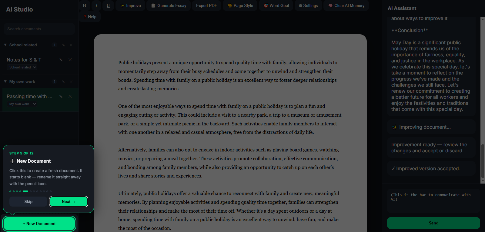
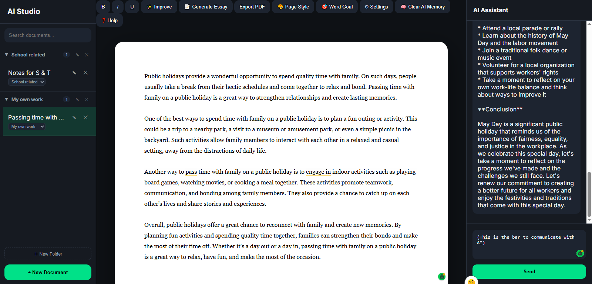
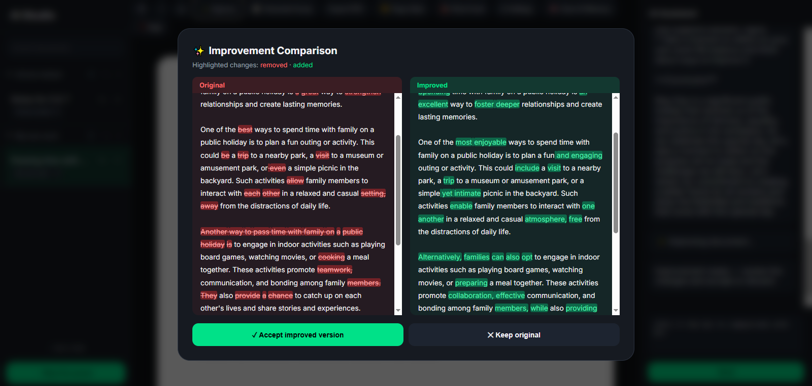

### Project Background

I made this project as a fun and easy way to learn to write essays better, utilising either the free Groq AI (via API key) or the powerful ChatGPT AI (API key that costs money) to improve the quality and engagement of the essay. This will allow the user improve significantly and write better without any extra cost.

### Technology Used

**HTML, JavaScript, AI API integration**

*This project is vibe-coded with AI.*

To improve the quality of the code, I used 3 different AIs below so that they can review and enhance each other's work
 - Google Gemini
 - ChatGPT
 - Claude

### How to use

 - Open `essay_writer.html` in any web browser, such as Google Chrome and Microsoft Edge. 
 - After that, a tutorial will be shown on how to use the different functions of the website. These instructions can be reviewed again with the `❓help` button. 
 
The website includes several features, such as:  
 - organisation of essays using folders
 - AI essay generation
 - AI essay improvement with comparisons to show difference between the original and improved essay 
 - export to PDF function.
 - Bar on the side to talk to AI

 ### Demo screens

**Tutorial(Step5/12)**

**Home Screen**

**Improve Essay**

