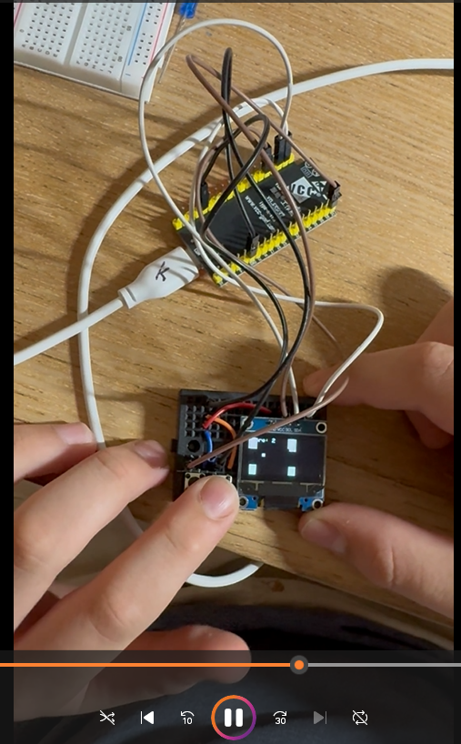

### Project Background

This project utilises the I2C driven OLED display and an ESP32 WROOM module to create a simple yet smooth simulation of the popular game **FlappyBird**.

### How it works

This game has two buttons, a reset button and a jump button. Upon powering up the esp32, the game will automatically start. To make the "bird" (square) jump, use the jump button. After dying, pressing the reset button will restart the game.

### Demo

