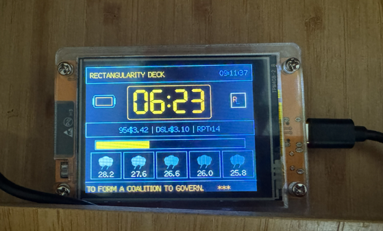

### Project Background

This is a hobby project on the `Cheap Yellow Display`, made up of an ESP32 and a TFT resistive touchscreen. It utilises API keys to get real-time information from the internet and displays it on the TFT screen, making it a great IoT project despite not utilising the touchscreen. 

### Features

- The current time on the top-right corner
- A pomodoro timer set for 10 minutes, which automatically restarts.
- Diesel, petrol prices, as well as the number of times the pomodoro timer has repeated, letting the user keep track of time.
- The weather forcast for the current hour and up to 4 hours later.
- News from BBC, which constantly refreshes then displays new headlines and text.

### Demo

