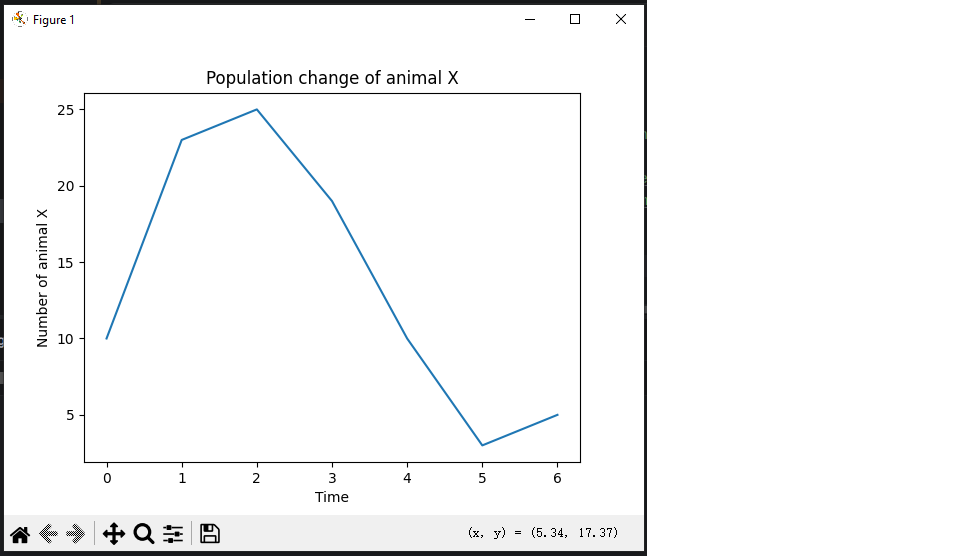

### Project Background

TODO for JY: 
Describe WHY this project was created
Then describe what this project does
Show sample output

### How to use

`python matplot_scientific_graph.py`

### Sample Input
```
Number of points: 7
Point 1 (X Y): 10 0
Point 2 (X Y): 23 1
Point 3 (X Y): 25 2
Point 4 (X Y): 19 3
Point 5 (X Y): 10 4
Point 6 (X Y): 3 5
Point 7 (X Y): 5 6
Y Axis Label: Number of animal X
X Axis Label: Time
Graph Title: Population change of animal X
```

### Sample Output

