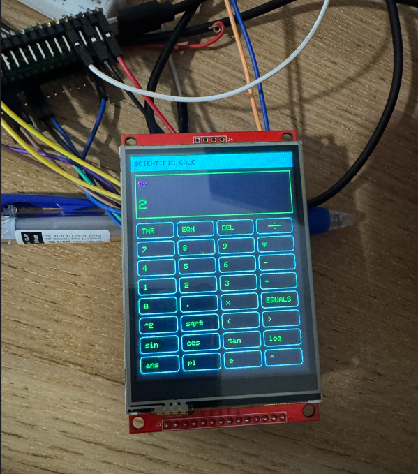

### Project Background

Ths project is a 3-in-1 productivity device, built with `Raspberry Pi Pico 2 W` and a `TFT resistive touchscreen` with the following features:
 - A scientific calculator with advanced symbols, as well as an algebraic equation solver.
 - A relaxation game where the player has to guess a 4 digit number, utilising colors to gain information about the numbers' location (like Wordle), and then deducing the number within 6 tries.
 - A text writer which allows the user to create or edit text files in `EDIT`, save it into folders in `FILE` then edit or read them as desired.

*Do note that this project is in prototyping stage, and as the wiring has been undone, I was unable to confirm that the code worked perfectly.*

### How it works

Pressing on the tabs/bars on the top of the screen allows the user to navigate through the 3 functions as shown above. When typing is needed, a virtual keyboard will automatically be shown, allowing the user to type from it.

### Demo

> This demo picture was taken from an slightly older version of the project. The latest code has made some further enhancements

